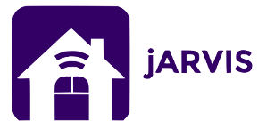

> Portal for managing household (like housekeeping book).

## Getting jARVIS

The docker way:
```
docker pull corka149/jarvis
```

## Version history

1. Version is the implementation of the the shopping list and user + user groups.
2. Version targets the connecting of sensor devices and measuring for monitoring the flat/house.
3. Version: 
    1. Marks the end of any work targeting smart home. In this version frontend and backend should be separated.
    2. Added finance domain
4. Version is the comeback of jARVIS as multipage application.
    1. Removed finance domain
    2. Added inventory domain with live views 🔥
5. Version: Tech stack switch to
    1. Rust for backend
    2. Angular with TypeScript for frontend
6. Version: Rewrite in Python with Django
